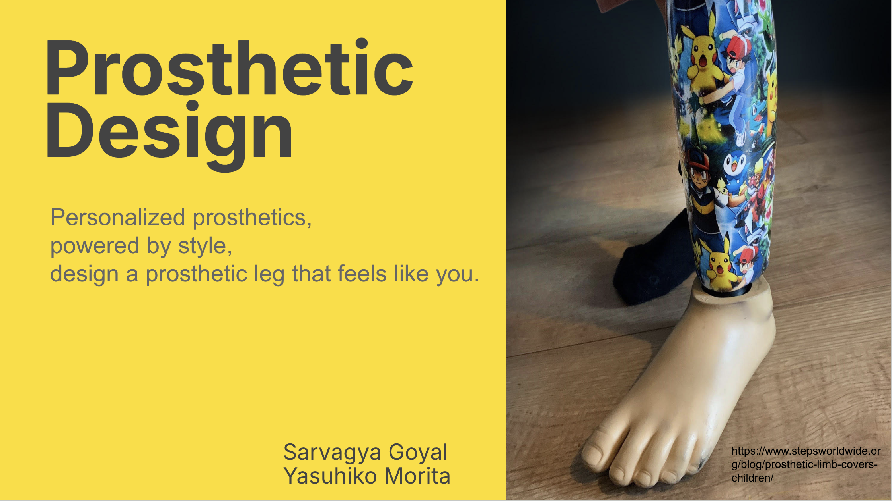
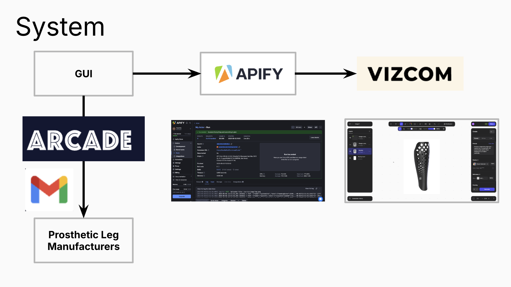
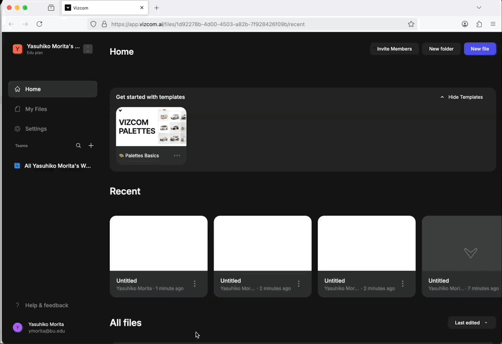
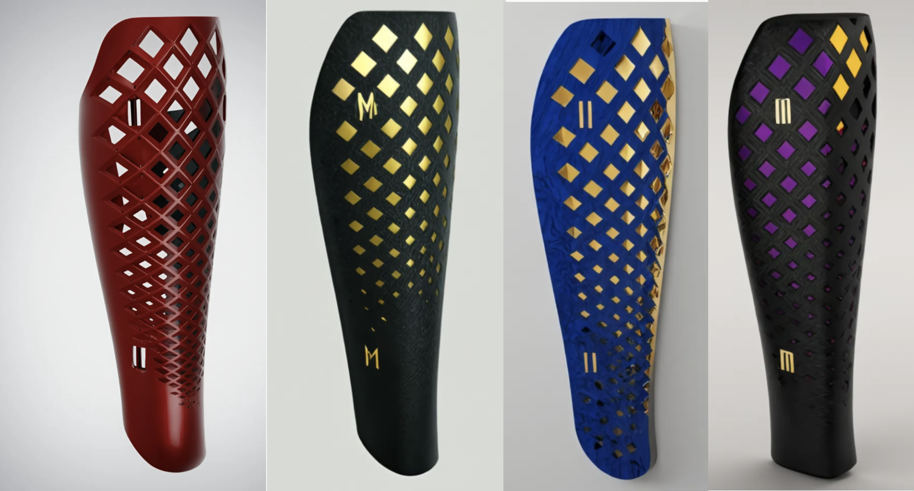

# Prosthetic Design



[](https://devpost.com/software/t-e5rljs)
🏆 **Winner of the Vizcom: Visual Intelligence Award** at the [MCP and A2A Hackathon - AWS Edition](https://lu.ma/vibecode?tk=V8VB1G)

Personalized prosthetics, powered by style. Design a prosthetic leg that feels like **you**.

---

## Inspiration
Our inspiration came from a close friend who needed a prosthetic leg. He wanted something that made him feel happy and reflected his personality, but he struggled to find a company that offered full customization. That experience made us realize how limited the options are for personalized prosthetics, and we wanted to build something to change that.

## What it does
The **Prosthetic Design** web application lets users select stylistic preferences—​color schemes, patterns, textures, or themes—​through a simple dropdown interface. These preferences are used to generate a one-of-a-kind prosthetic leg design, which is then forwarded directly to a prosthetics manufacturer for production.

## How it works
1. **Vizcom automation** – Vizcom's design AI has no public API, so we built an `Apify` **Actor** (see `my-actor/src/main.py`) that drives Vizcom through a headless **Playwright** browser session. The Actor uploads a source image *or* a text-prompt, waits for Vizcom to generate a 3-D model, and automatically exports a `GLB`/`STL` file.
2. **MCP orchestration** – Mastra **MCP** coordinates multiple agentic components, invoking the Apify Actor and post-processing the result.
3. **Arcade.dev e-mail automation** – When a design is ready, an automated e-mail with the 3-D model attached is sent to the selected prosthetics manufacturer.

```
┌─────────────┐     1      ┌──────────────┐     2      ┌───────────────┐     3      ┌────────────────┐
│   Frontend  │──────────▶│  Apify Actor │──────────▶│   MCP Flow    │──────────▶│  Arcade.dev     │
│ (Next.js)   │  prompt   │  (Playwright)│  .glb/.stl │  (TypeScript) │  email   │ Manufacturer    │
└─────────────┘            └──────────────┘            └───────────────┘            └────────────────┘
```

## System architecture



### Vizcom automation demo



*The Apify Actor (agent) controls Vizcom headlessly via Playwright, performing all clicks, uploads, and exports without human intervention.*

## Tech stack
- **Python** + **Playwright** + **Apify SDK** for browser automation
- **Mastra MCP** for orchestration / agent framework
- **Arcade.dev** for transactional e-mail
- **Node.js / TypeScript / Next.js** for the web UI
- **Vizcom** generative 3-D design engine

## Repository structure
```
.
├── README.md                ← you are here
├── my-actor/                ← Apify Actor (Python + Playwright)
│   ├── src/main.py          ← main automation script
│   ├── requirements.txt     ← Python dependencies
│   └── ...
├── frontend/                ← (optional) Next.js web app — not included in this repo
└── ...
```

## Getting started (local)

### Prerequisites
- Python ≥ 3.10
- Node.js ≥ 18 (if you plan to run the frontend)
- [Apify CLI](https://docs.apify.com/cli) `npm i -g apify`
- Playwright browsers: `python -m playwright install firefox`

### 1 · Clone & install
```bash
git clone https://github.com/your-org/prosthetic-design.git
cd prosthetic-design/my-actor
pip install -r requirements.txt
```

### 2 · Configure secrets
Create a `.env` file (or export env-vars) with your Vizcom credentials:
```dotenv
VISCOM_USER=you@example.com
VISCOM_PASSWORD=super-secret
```

### 3 · Run the Actor
```bash
# from the my-actor directory
apify run --debug --headed  # headed mode helps when debugging the browser
```
The Actor will upload `leg.png` by default (or download an image when `--imageUrl` is supplied), generate a 3-D model, and export `exported.glb` to the Apify key-value store.

### Optional CLI flags
```bash
--imageUrl <url>    # remote image to use instead of leg.png
--prompt "neon pink cyberpunk pattern"  # combine prompt + image workflow
--headed            # run browser in non-headless mode
--debug             # verbose logging
```

## Deploy to Apify Cloud
```bash
# authenticate once
apify login # paste your API token

# deploy actor from my-actor directory
apify push
```
Then trigger the Actor either via the Apify UI or a simple HTTPS request:
```bash
curl -X POST \
  -d '{"imageUrl":"https://example.com/leg.jpg"}' \
  "https://api.apify.com/v2/acts/<username>~prosthetic-design/run-sync?token=<APIFY_TOKEN>"
```

## Challenges
- **No Vizcom API** – we reverse-engineered the UI and built resilient Playwright selectors with retry logic.
- **Headless browser quirks** – WebGL and dynamic React components required multiple workarounds.

## Accomplishments
- Fully automated Vizcom generation flow with zero manual clicks
- Seamless e-mail hand-off to manufacturers
- End-to-end personalization from user style input to production-ready 3-D model

## What we learned
- Deep dive into Apify's Python SDK and storage primitives
- Coordinating multiple agentic frameworks (Apify, MCP) in a single product

## Sample generated models



<sub>Four color-way examples</sub>

## Roadmap
- Expand beyond legs: arms, feet, and limb covers
- ✅ Add live 3-D preview in the web UI (three.js)
- Integrate pricing & order-tracking APIs from manufacturers

## License
Distributed under the MIT License. See [`LICENSE`](LICENSE) for more information. 